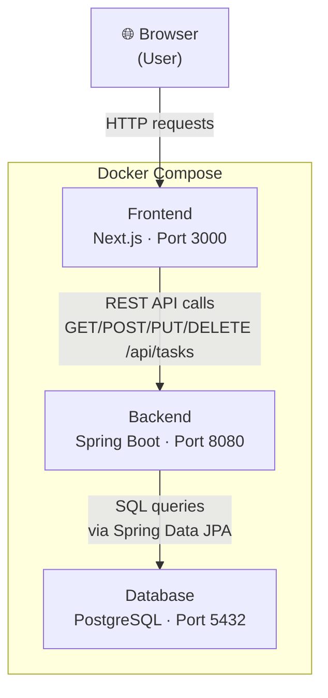

# TaskFlow – Fullstack Development Workshop

> A 4-hour hands-on workshop where you build a fullstack task management application from scratch.

---

## Prerequisites

Make sure the following are installed before the workshop:

| Tool | Minimum version | Check with |
|---|---|---|
| [Docker Desktop](https://www.docker.com/products/docker-desktop/) | 24+ | `docker --version` |
| [Docker Compose](https://docs.docker.com/compose/) | v2+ | `docker compose version` |
| [Git](https://git-scm.com/) | 2+ | `git --version` |
| [Postman](https://www.postman.com/) or [Bruno](https://www.usebruno.com/) | any | – |

> **Optional** (for local development outside Docker):
> - Java 21 ([Eclipse Temurin](https://adoptium.net/))
> - Node.js 22+

---

## Quick Start (Local – Docker Compose)

```bash
# 1. Clone the repository
git clone https://github.com/codeclubcph/idea-to-production.git
cd idea-to-production

# 2. Create your environment file
cp .env.example .env

# 3. Start everything – run from the REPO ROOT so .env is found automatically
docker compose -f infra/docker-compose.yml up --build
```

Once the containers are running:

| Service | URL |
|---|---|
| Frontend | http://localhost:3000 |
| Backend API | http://localhost:8080 |
| Health check | http://localhost:8080/health |
| Actuator | http://localhost:8080/actuator/health |

---

## Folder Structure

```
idea-to-production/
├── backend/                        # Spring Boot application (Java 21)
│   ├── src/main/java/com/taskflow/
│   │   ├── TaskflowApplication.java  # Entry point
│   │   ├── controller/               # HTTP layer – handles requests & responses
│   │   ├── service/                  # Business logic layer
│   │   ├── repository/               # Database layer (Spring Data JPA)
│   │   ├── model/                    # JPA entities and enums
│   │   └── config/                   # Spring configuration (CORS, etc.)
│   ├── src/main/resources/
│   │   └── application.yml           # App configuration
│   ├── build.gradle                  # Gradle build file
│   └── Dockerfile                    # Backend container definition
│
├── frontend/                       # Next.js application (TypeScript)
│   ├── src/
│   │   ├── app/                      # Next.js App Router pages
│   │   ├── components/               # Reusable React components (you'll add these)
│   │   ├── lib/
│   │   │   └── api.ts                # API client – all backend calls go here
│   │   └── types/
│   │       └── task.ts               # TypeScript types for Task domain
│   └── Dockerfile                    # Frontend container definition
│
├── infra/
│   └── docker-compose.yml          # Orchestrates all three services
│
├── .env.example                    # Template for environment variables
└── README.md                       # This file
```

---

## Architecture



---

## Workshop Checkpoints

Work through these in order. Each checkpoint builds on the previous one.

### Backend

| # | Checkpoint | File to edit |
|---|---|---|
| 1 | **Create Task repository** – add custom finder methods | `repository/TaskRepository.java` |
| 2 | **Create Task service** – implement CRUD business logic | `service/TaskService.java` |
| 3 | **Create CRUD REST endpoints** – expose the API | `controller/TaskController.java` |
| 4 | **Test API using Postman** – verify all endpoints work | – |

### Full-Stack

| # | Checkpoint | File to edit |
|---|---|---|
| 5 | **Connect frontend to backend** – implement API client | `frontend/src/lib/api.ts` |
| 6 | **Display tasks in UI** – create TaskList component | `frontend/src/components/` |
| 7 | **Create tasks from UI** – add TaskForm component | `frontend/src/components/` |
| 8 | **Persist tasks in PostgreSQL** – verify end-to-end flow | – |

### DevOps

| # | Checkpoint | Description |
|---|---|---|
| 9 | **Containerise & understand architecture** | Explore Dockerfiles and docker-compose.yml |
| 10 | **Deploy application** | Deploy to a cloud provider of your choice |

---

## Useful Commands

```bash
# Rebuild and restart all containers (always run from repo root)
docker compose -f infra/docker-compose.yml up --build

# View logs for a specific service
docker compose -f infra/docker-compose.yml logs -f backend
docker compose -f infra/docker-compose.yml logs -f frontend
docker compose -f infra/docker-compose.yml logs -f postgres

# Stop all containers
docker compose -f infra/docker-compose.yml down

# Stop and delete all data (volumes)
docker compose -f infra/docker-compose.yml down -v

# Run backend tests (requires Java 21 locally)
cd backend && ./gradlew test

# Run frontend tests (requires Node.js locally)
cd frontend && npm test

# Start frontend in dev mode (requires Node.js locally)
cd frontend && npm install && npm run dev
```

---

## Tech Stack

| Layer | Technology | Version |
|---|---|---|
| Frontend | Next.js | 15 (App Router) |
| Language | TypeScript | 5 |
| Backend | Spring Boot | 3.5 |
| Language | Java | 21 LTS |
| Build tool | Gradle | (wrapper included) |
| Database | PostgreSQL | 16 |
| Containers | Docker + Compose | v2 |

---

## Deploying to Railway

[Railway](https://railway.com) is a cloud platform that can host all three services. The flow below takes about 10–15 minutes.

### Architecture on Railway

```
[Browser]
    │  HTTPS
    ▼
[Frontend service]          ← Next.js, public URL
    │  HTTPS (NEXT_PUBLIC_API_URL)
    ▼
[Backend service]           ← Spring Boot, public URL
    │  Private network
    ▼
[Postgres plugin]           ← managed PostgreSQL
```

### Step-by-step

**1 – Create a Railway project**

Sign in at [railway.com](https://railway.com) → **New Project** → **Empty project**.

---

**2 – Add a PostgreSQL database**

Inside the project → **+ New** → **Database** → **Add PostgreSQL**.

Railway creates the database and exposes connection variables (`PGHOST`, `PGPORT`, `PGDATABASE`, `PGUSER`, `PGPASSWORD`) automatically.

---

**3 – Deploy the backend**

- **+ New** → **GitHub Repo** → select your repo → Settings Tab -> Source -> Set **Root Directory** to `backend`.
- Railway detects `backend/railway.toml` and uses the `backend/Dockerfile`.
- Go to the backend service → **Variables** → add **all five** of these:

| Variable | Value (use the "Reference" picker in Railway) |
|---|---|
| `DB_HOST` | `${{Postgres.PGHOST}}` ← easy to forget! |
| `DB_PORT` | `${{Postgres.PGPORT}}` |
| `DB_NAME` | `${{Postgres.PGDATABASE}}` |
| `DB_USER` | `${{Postgres.PGUSER}}` |
| `DB_PASSWORD` | `${{Postgres.PGPASSWORD}}` |

> ⚠️ **All five variables are required.** If `DB_HOST` is missing the backend will
> silently fall back to `localhost`, which doesn't resolve inside Railway's network,
> and the database connection will fail.

- In Settings, Networking section, enable Public Domain by use of **Generate Domain** for the backend
- Press Deploy service and copy the URL in Settings/Networking/Public Networking
  (e.g. `https://taskflow-backend-production.up.railway.app`).

---

**4 – Deploy the frontend**

- **+ New** → **GitHub Repo** → same repo → set **Root Directory** to `frontend`.
- Railway detects `frontend/railway.toml` and uses the `frontend/Dockerfile`.
- Go to the frontend service → **Variables** → add:

| Variable | Value |
|---|---|
| `NEXT_PUBLIC_API_URL` | `https://taskflow-backend-production.up.railway.app` (your backend URL from step 3) |

> ⚠️ `NEXT_PUBLIC_API_URL` is embedded into the JavaScript bundle **at build time**.
> Set it **before** clicking Deploy (or redeploy after setting it).

- Enable a **Public Domain** in **Settings/Networking/Generate Domain** for the frontend (the domain will be generated after Deploy)
- Open the URL to verify

---

**5 – Update backend CORS**

Now that you know the frontend's Railway URL, go back to the **backend** service → **Variables** → add:

| Variable | Value |
|---|---|
| `CORS_ALLOWED_ORIGINS` | `https://taskflow-frontend-production.up.railway.app` |

Railway will automatically redeploy the backend.

---

### Summary of Railway environment variables

| Service | Variable | Value |
|---|---|---|
| Backend | `DB_HOST` | `${{Postgres.PGHOST}}` |
| Backend | `DB_PORT` | `${{Postgres.PGPORT}}` |
| Backend | `DB_NAME` | `${{Postgres.PGDATABASE}}` |
| Backend | `DB_USER` | `${{Postgres.PGUSER}}` |
| Backend | `DB_PASSWORD` | `${{Postgres.PGPASSWORD}}` |
| Backend | `CORS_ALLOWED_ORIGINS` | `https://<your-frontend>.up.railway.app` |
| Backend | `PORT` | **Injected automatically – do not set** |
| Frontend | `NEXT_PUBLIC_API_URL` | `https://<your-backend>.up.railway.app` |
| Frontend | `PORT` | **Injected automatically – do not set** |

---

## Troubleshooting

**`docker compose` fails – port already in use**
> Change the port in `.env` (e.g. `BACKEND_PORT=8081`) and rerun from the repo root.

**Backend can't connect to the database**
> Make sure the `postgres` service is healthy before the backend starts.
> `docker compose -f infra/docker-compose.yml logs postgres`

**Frontend shows "not implemented yet" errors**
> That's expected! Follow the checkpoints to implement the API client.

**Changes to source code aren't reflected**
> `docker compose -f infra/docker-compose.yml up --build`

**Railway – backend starts but cannot connect to the database**
> The most common cause is a missing `DB_HOST` variable. Check that all five
> `DB_*` variables are set in the backend service's Railway Variables tab.
> If `DB_HOST` is absent, Spring Boot falls back to `localhost`, which does not
> resolve to PostgreSQL inside Railway's private network.

**Railway deploy fails – healthcheck timeout**
> Java startup can be slow on Railway's free tier. The `railway.toml` already sets
> `healthcheckTimeout = 120`. If it still times out, try deploying again.

**Railway frontend shows old backend URL**
> `NEXT_PUBLIC_API_URL` is baked at build time. Update the variable in the Railway
> dashboard and click **Redeploy** to rebuild the image with the new URL.

