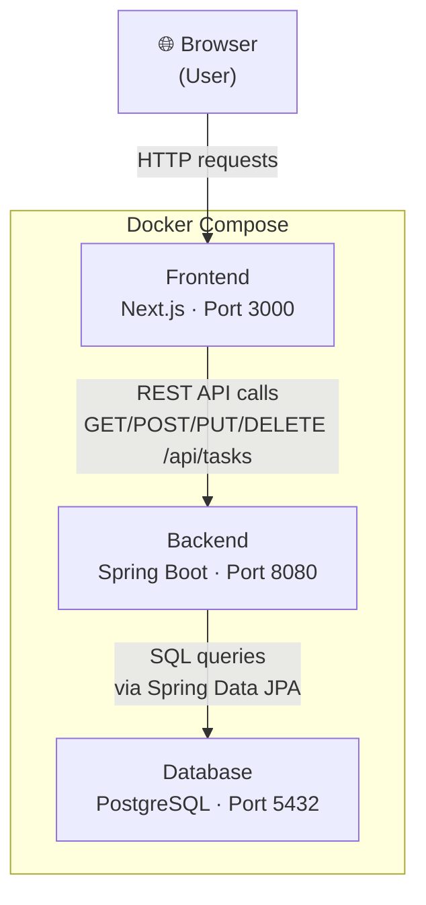

# TaskFlow – Fullstack Development Workshop

> A 4-hour hands-on workshop where you build a fullstack task management application from scratch.

---

## Prerequisites

Make sure the following are installed before the workshop:

| Tool | Minimum version | Check with |
|---|---|---|
| [Docker Desktop](https://www.docker.com/products/docker-desktop/) | 24+ | `docker --version` |
| [Docker Compose](https://docs.docker.com/compose/) | v2+ | `docker compose version` |
| [Git](https://git-scm.com/) | 2+ | `git --version` |
| [Postman](https://www.postman.com/) or [Bruno](https://www.usebruno.com/) | any | – |

> **Optional** (for local development outside Docker):
> - Java 21 ([Eclipse Temurin](https://adoptium.net/))
> - Node.js 22+

---

## Quick Start

```bash
# 1. Clone the repository
git clone <repository-url>
cd idea-to-production

# 2. Create your environment file
cp .env.example .env

# 3. Start everything
cd infra
docker compose up --build
```

Once the containers are running:

| Service | URL |
|---|---|
| Frontend | http://localhost:3000 |
| Backend API | http://localhost:8080 |
| Health check | http://localhost:8080/health |
| Actuator | http://localhost:8080/actuator/health |

---

## Folder Structure

```
idea-to-production/
├── backend/                        # Spring Boot application (Java 21)
│   ├── src/main/java/com/taskflow/
│   │   ├── TaskflowApplication.java  # Entry point
│   │   ├── controller/               # HTTP layer – handles requests & responses
│   │   ├── service/                  # Business logic layer
│   │   ├── repository/               # Database layer (Spring Data JPA)
│   │   ├── model/                    # JPA entities and enums
│   │   └── config/                   # Spring configuration (CORS, etc.)
│   ├── src/main/resources/
│   │   └── application.yml           # App configuration
│   ├── build.gradle                  # Gradle build file
│   └── Dockerfile                    # Backend container definition
│
├── frontend/                       # Next.js application (TypeScript)
│   ├── src/
│   │   ├── app/                      # Next.js App Router pages
│   │   ├── components/               # Reusable React components (you'll add these)
│   │   ├── lib/
│   │   │   └── api.ts                # API client – all backend calls go here
│   │   └── types/
│   │       └── task.ts               # TypeScript types for Task domain
│   └── Dockerfile                    # Frontend container definition
│
├── infra/
│   └── docker-compose.yml          # Orchestrates all three services
│
├── .env.example                    # Template for environment variables
└── README.md                       # This file
```

---

## Architecture



---

## Workshop Checkpoints

Work through these in order. Each checkpoint builds on the previous one.

### Backend

| # | Checkpoint | File to edit |
|---|---|---|
| 1 | **Create Task repository** – add custom finder methods | `repository/TaskRepository.java` |
| 2 | **Create Task service** – implement CRUD business logic | `service/TaskService.java` |
| 3 | **Create CRUD REST endpoints** – expose the API | `controller/TaskController.java` |
| 4 | **Test API using Postman** – verify all endpoints work | – |

### Full-Stack

| # | Checkpoint | File to edit |
|---|---|---|
| 5 | **Connect frontend to backend** – implement API client | `frontend/src/lib/api.ts` |
| 6 | **Display tasks in UI** – create TaskList component | `frontend/src/components/` |
| 7 | **Create tasks from UI** – add TaskForm component | `frontend/src/components/` |
| 8 | **Persist tasks in PostgreSQL** – verify end-to-end flow | – |

### DevOps

| # | Checkpoint | Description |
|---|---|---|
| 9 | **Containerise & understand architecture** | Explore Dockerfiles and docker-compose.yml |
| 10 | **Deploy application** | Deploy to a cloud provider of your choice |

---

## Useful Commands

```bash
# Rebuild and restart all containers
docker compose up --build

# View logs for a specific service
docker compose logs -f backend
docker compose logs -f frontend
docker compose logs -f postgres

# Stop all containers
docker compose down

# Stop and delete all data (volumes)
docker compose down -v

# Run backend tests (requires Java 21 locally)
cd backend && ./gradlew test

# Install frontend dependencies (requires Node.js locally)
cd frontend && npm install && npm run dev
```

---

## Tech Stack

| Layer | Technology | Version |
|---|---|---|
| Frontend | Next.js | 15 (App Router) |
| Language | TypeScript | 5 |
| Backend | Spring Boot | 3.5 |
| Language | Java | 21 LTS |
| Build tool | Gradle | (wrapper included) |
| Database | PostgreSQL | 16 |
| Containers | Docker + Compose | v2 |

---

## Troubleshooting

**`docker compose up` fails – port already in use**
> Change the port in `.env` (e.g. `BACKEND_PORT=8081`) and restart.

**Backend can't connect to the database**
> Make sure the `postgres` service is healthy before the backend starts.
> Run `docker compose logs postgres` to check.

**Frontend shows "not implemented yet" errors**
> That's expected! Follow the checkpoints to implement the API client.

**Changes to source code aren't reflected**
> Run `docker compose up --build` to rebuild the images.

